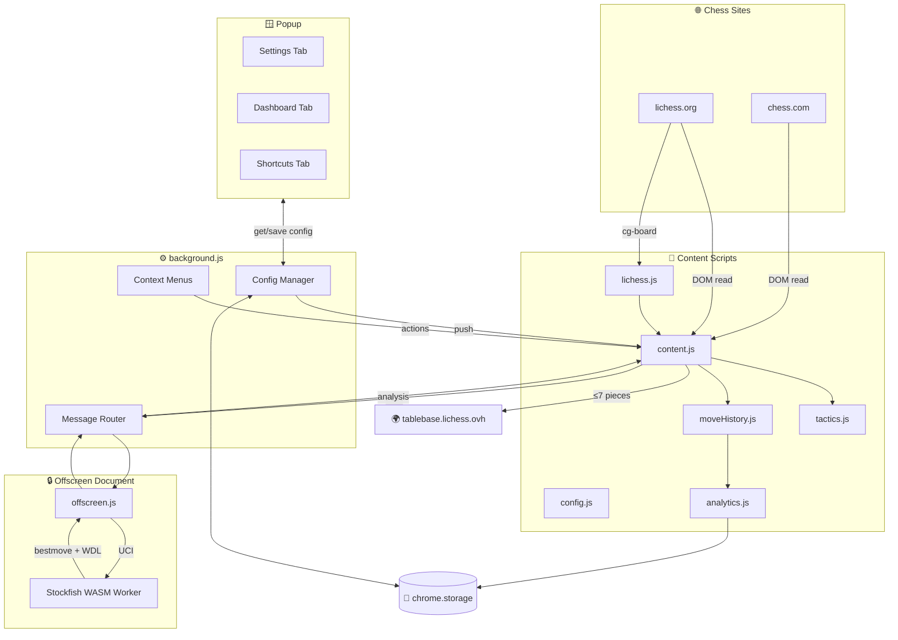

# Chess Trainer Extension — Architecture

## Data Flow



## File Overview

| File | Role |
|------|------|
| `manifest.json` | MV3 manifest — permissions, scripts, commands |
| `background.js` | Service worker — routes FEN to engine, manages config, context menus |
| `offscreen.html/js` | Offscreen doc — runs Stockfish WASM in a Web Worker |
| `engine/stockfish.js` | Stockfish 18 Lite (WASM loader) |
| `engine/stockfish.wasm` | Stockfish binary (~700KB) |
| `content.js` | Main controller — reads board, renders overlays, handles features |
| `config.js` | Shared default config object |
| `moveHistory.js` | Tracks FENs, detects new games, classifies moves |
| `tactics.js` | Fork/pin/back-rank detection, puzzle check, move explanations |
| `analytics.js` | Game stats, bookmarks, opponent profiling, dashboard data |
| `lichess.js` | Lichess `cg-board` DOM reader → FEN |
| `openings.json` | ~75 ECO opening positions |
| `overlay.css` | Styles for all board overlays |
| `popup.html/css/js` | Tabbed popup UI (Settings / Dashboard / Keys) |
| `sounds/blunder.wav` | Alert tone |

## Feature Map

```mermaid
mindmap
  root((Chess Trainer))
    Visual
      Curved Bezier Arrows
      PV Line Visualization
      Arrow Fade Animation
      Eval Badge
      WDL Bar
      Opening Name Pill
      Move Classification
    Intelligence
      Time Trouble Alert
      Endgame Tablebase
      Opponent Profiler
    Training
      Move Explanations
      Puzzle Detection
      Pattern Recognition
      Post-Game Summary
    UX
      Keyboard Shortcuts
      Right-Click Menu
      Streamer Mode
      Position Bookmarks
      Board Screenshot
    Analytics
      Performance Dashboard
      Opening Repertoire
